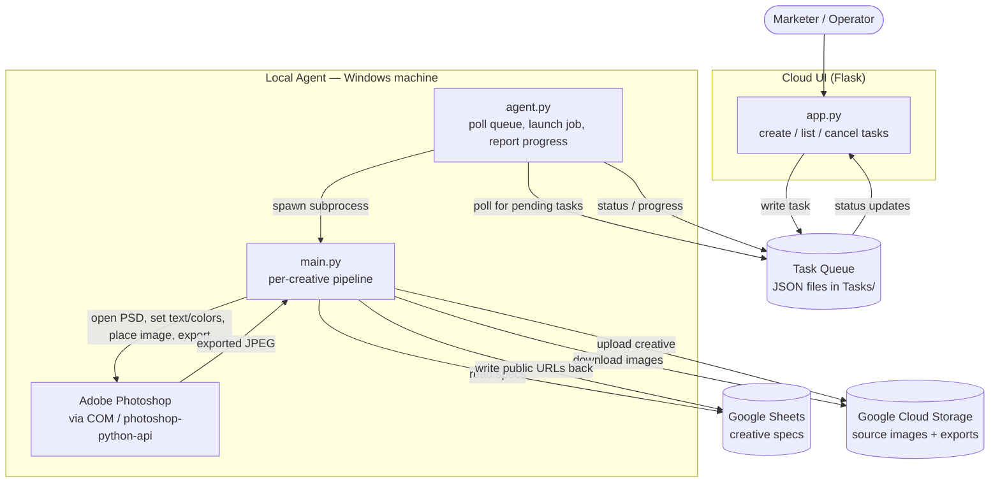

# Photoshop Bulk Ad-Creative Automation

Generate hundreds of on-brand ad creatives by driving Adobe Photoshop programmatically from Python — fed by Google Sheets specs and orchestrated through a cloud UI.

    

> **Note:** This repo is a public snapshot of a private production codebase — history squashed to a single commit to strip credentials and client data.

## Overview

Producing ad creatives by hand does not scale. A single campaign can need the same message rendered across multiple aspect ratios (4:5 for feeds, 9:16 for stories), multiple languages, and dozens of copy and color variants. Doing this manually in Photoshop is slow, repetitive, and error-prone.

I built this system to automate that work end-to-end. It reads creative specs from a Google Sheet (copy, CTA, colors, image references, template name), pulls the matching imagery, opens a PSD template in Photoshop, injects the text and colors, fits the image into the layout, exports a flattened JPEG, and uploads the result back to cloud storage — writing the public URLs straight back into the sheet. A marketer fills in a spreadsheet; the system returns finished creatives.

The part I am most proud of is how the rendering actually happens: instead of an image library that approximates Photoshop, the system **drives a real Photoshop instance through its COM automation interface**, so every creative is rendered by Photoshop itself with full fidelity to the designer's template. On top of that sits a **hybrid local-agent / cloud-UI architecture** that lets the heavy desktop automation run on a Windows machine while the campaign is queued and monitored from a browser.

## Key Features

- **Programmatic Photoshop rendering via COM** — opens PSD templates, replaces text-layer contents, recolors background / text / button layers, and places imagery using `photoshop-python-api` over the Windows COM bridge.
- **Spec-driven from Google Sheets** — reads each creative's primary text, CTA, button text, colors, text-size percentage, template, and stock-image URLs from a worksheet, with fuzzy worksheet-name matching and tolerant column-name parsing.
- **Smart image placement** — downloads images, normalizes them (EXIF transpose, RGBA→RGB), then scales and centers each one into the template's placeholder bounds with a clipping mask so the artwork always fills the layout cleanly.
- **Color & text automation** — applies hex colors to background, text, CTA, and button layers; auto-replaces missing fonts to suppress dialogs; and auto-shrinks copy to prevent text overflow.
- **AI image generation** — companion bulk scripts call Midjourney (via the goAPI relay) and OpenAI to generate source imagery, split 2×2 collages into quadrants, and compress to target file sizes.
- **Idempotent batch processing** — skips rows that already have output links, so a run can be safely re-run after a partial failure; per-row error isolation keeps one bad row from stopping the batch.
- **Hybrid cloud-UI + local-agent design** — a Flask app queues tasks; a polling agent on the Photoshop machine picks them up, runs them, reports progress, and supports cancellation.
- **Resilient uploads** — exports are pushed to Google Cloud Storage with public URLs (falling back to 30-day signed URLs when the bucket is private) and the resulting links are written back into the source sheet.

## Architecture

The system separates orchestration (which can live anywhere) from execution (which must run where Photoshop is installed). The two communicate through a shared task queue of JSON files.



The queue is intentionally simple (atomic JSON file writes), and the agent also supports a remote store over SFTP, so the cloud UI and the Photoshop host do not have to share a filesystem.

## Tech Stack

| Area | Technology |
| --- | --- |
| Language | Python 3 |
| Desktop automation | Adobe Photoshop COM bridge via `photoshop-python-api` (pywin32 under the hood) |
| Cloud UI | Flask (`cloud_ui/app.py`, `wsgi.py`) |
| Task queue | JSON files on disk, with optional SFTP remote store (`paramiko`) |
| Spreadsheet I/O | Google Sheets via `gspread` + `google-auth` |
| Object storage | Google Cloud Storage (`google-cloud-storage`) |
| Image processing | Pillow (PIL) |
| AI image generation | Midjourney (goAPI relay), OpenAI |

## Requirements

> **Important: this project requires Windows + Adobe Photoshop.**
> The rendering pipeline drives Photoshop through its **COM automation interface**, so the local agent and `main.py` must run on a **Windows machine with Adobe Photoshop installed and licensed**. There is no headless / Linux fallback for the rendering step — the COM dependency is fundamental to how creatives are produced.

- Windows 10/11 with Adobe Photoshop installed
- Python 3.9+
- A Google Cloud service account with access to your Sheet and your GCS bucket (`service_account.json`)
- PSD templates containing the expected named layers (e.g. `Temp_Img_Placeholder`, `Temp_Text_Layer`, `Temp_Cta_Layer`)

The Flask cloud UI itself can run on any platform — only the local agent / Photoshop step is Windows-bound.

## Getting Started

```bash
# 1. Clone and enter the project
git clone <your-repo-url>
cd photoshop-creative-automation

# 2. Create and activate a virtual environment (Windows / PowerShell)
python -m venv .venv
.venv\Scripts\Activate.ps1

# 3. Install dependencies
pip install -r requirements.txt

# 4. Configure environment
copy .env.example .env        # then edit .env with your real values

# 5. Provide credentials
#    Place your Google service account key as service_account.json in the
#    project root. This file is gitignored and must never be committed.
```

Set your secrets in `.env` (or as real environment variables): `OPENAI_API_KEY`, `MIDJOURNEY_API_KEY`, `GOOGLE_SHEET_URL`, `SHEET_NAME`, and `GCS_BUCKET`.

Run the system:

```bash
# A) Start the local agent on the Windows + Photoshop machine.
#    It polls the Tasks/ queue and runs main.py per task.
python -m local_agent.agent

# B) Start the cloud UI (any machine) to create and monitor tasks.
python cloud_ui/app.py        # serves on http://localhost:5000

# Optional: run a single batch directly, without the agent/UI,
# using the values from your environment.
python main.py
```

Create a task from the UI (or drop a JSON task file into `Tasks/`); the agent will detect it, render every eligible row of the sheet through Photoshop, upload the creatives, and write the resulting URLs back into the sheet.

## Project Structure

```
photoshop-creative-automation/
├── main.py                     # Core pipeline: Sheets → Photoshop → GCS per creative
├── color_automation.py         # Hex-color fills for bg/text/CTA/button layers
├── text_size_automation.py     # Text scaling and overflow prevention
├── fill_random_colors.py       # Color helper / experimentation utility
├── requirements.txt            # Python dependencies
├── .env.example                # Template for required environment variables
│
├── local_agent/                # Runs on the Windows + Photoshop host
│   ├── agent.py                # Polls the queue, launches jobs, reports progress
│   └── task_store.py           # Local + remote (SFTP) task stores
│
├── cloud_ui/                   # Browser-facing orchestration
│   ├── app.py                  # Flask app: create / list / cancel / delete tasks
│   └── wsgi.py                 # WSGI entry point
│
└── bulk_generation/            # AI image-generation batch tools
    ├── midjourney_bulk.py      # Midjourney bulk generation + collage splitting
    ├── image_generation.py     # Image generation pipeline (OpenAI)
    └── text_generation.py      # Bulk copy / text generation
```

## Notes & Disclaimers

This is a personal portfolio project. Templates, sheet IDs, bucket names, and credentials shown here are placeholders — no real secrets are committed, and `service_account.json` and `.env` are gitignored. Photoshop is a trademark of Adobe; this project automates a locally installed, licensed copy and is not affiliated with or endorsed by Adobe.
